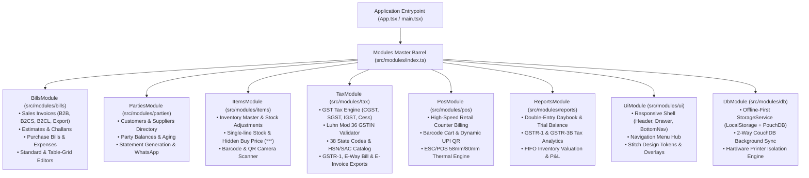
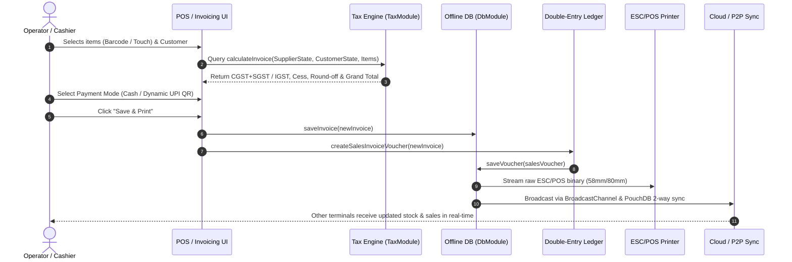
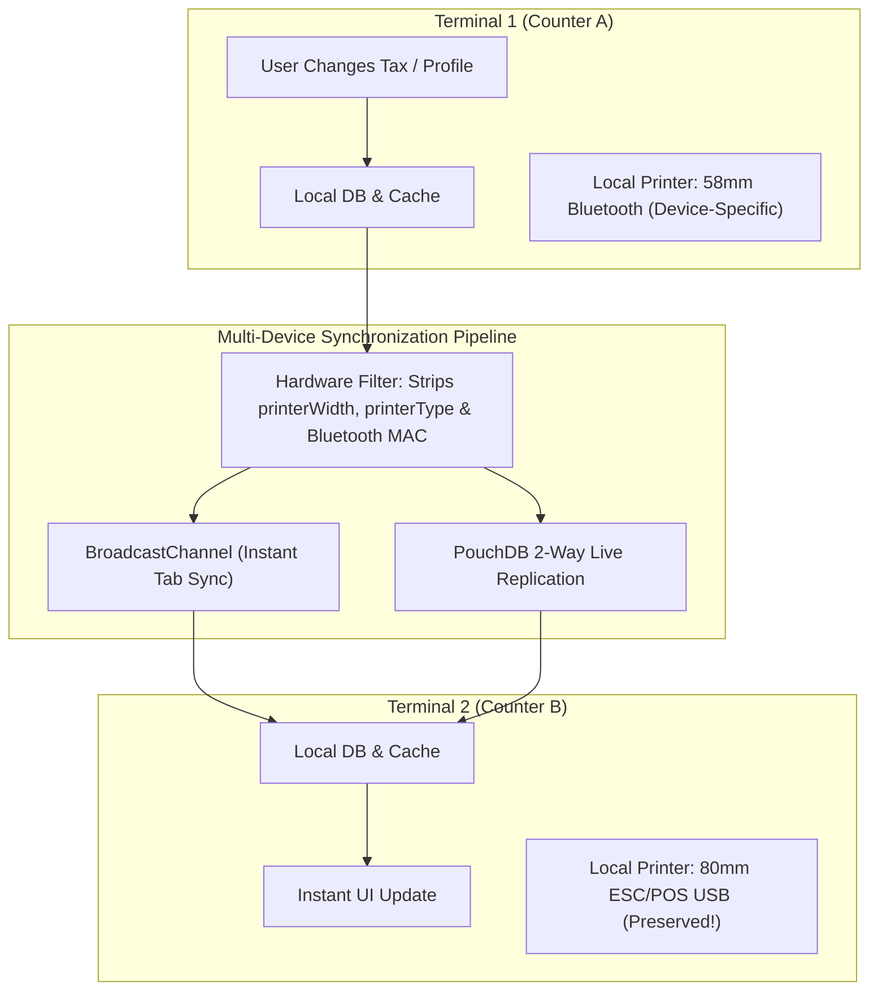

# Vyapar GST Billing & Accounting: Complete System Architecture & Workflow

Comprehensive technical reference, modular architecture documentation, and end-to-end business workflows for the **Vyapar GST Billing & Accounting Application**.

---

## 1. Modular Architecture Overview

The codebase is organized into **domain-driven modules** located in [`src/modules/`](file:///data/data/com.termux/files/home/gst-billing-app/src/modules):

---

## 2. Domain Modules Reference

### 2.1 `BillsModule` (`src/modules/bills`)
- **Models**: [`Invoice`](file:///data/data/com.termux/files/home/gst-billing-app/src/models/invoice.ts), [`InvoiceItemEntry`](file:///data/data/com.termux/files/home/gst-billing-app/src/models/invoice.ts), [`PurchaseBill`](file:///data/data/com.termux/files/home/gst-billing-app/src/models/purchase.ts), [`Expense`](file:///data/data/com.termux/files/home/gst-billing-app/src/models/expense.ts).
- **Components**:
  - `CreateInvoiceModal`: Touch-friendly standard form invoice builder with live GST bifurcation and customer state detection.
  - `TableGridInvoiceModal`: Keyboard-optimized, high-speed retail/wholesale spreadsheet data entry grid.
  - `InvoicePreviewModal`: Pixel-accurate document viewer with print layout switching (A4 Laser Modern vs. Thermal Slip).
  - `SalesHubView`: Centralized document dashboard filtering Invoices, Quotations, and Delivery Challans.
  - `PurchasesHubView`: Inward purchase invoices with Input Tax Credit (ITC) categorization.
  - `ExpensesView`: Daily store expenditures categorized for GSTR-3B compliance.

### 2.2 `PartiesModule` (`src/modules/parties`)
- **Models**: [`Party`](file:///data/data/com.termux/files/home/gst-billing-app/src/models/party.ts) (`CUSTOMER` | `SUPPLIER`).
- **Components**:
  - `PartiesView`: Searchable, filterable ledger list displaying current balance (To Receive / To Pay).
  - `PartyDetailModal`: Complete transaction statement, invoice history, payment ledger, and direct WhatsApp PDF share.
  - `SelectPartyModal`: Fast-select dropdown with auto-creation of walk-in or new B2B accounts.

### 2.3 `ItemsModule` (`src/modules/items`)
- **Models**: [`InventoryItem`](file:///data/data/com.termux/files/home/gst-billing-app/src/models/item.ts), [`StockAdjustment`](file:///data/data/com.termux/files/home/gst-billing-app/src/models/item.ts), [`UnitOfMeasurement`](file:///data/data/com.termux/files/home/gst-billing-app/src/models/item.ts).
- **Features**:
  - **Single-Line Layout**: Sale price, buy price (masked with `***` and click-to-reveal security toggle), and available stock rendered cleanly in one line.
  - **Simplified Multi-Criteria Filters**: Filter catalog by Item Name, Available Stock, Category, or Creation Date.
  - **Barcode Scanning**: Integrated with camera barcode scanner and hardware USB scanners.

### 2.4 `TaxModule` (`src/modules/tax`)
- **Core Functions**:
  - [`calculateItemGst`](file:///data/data/com.termux/files/home/gst-billing-app/src/core/gst/calculator.ts): Splits taxes into CGST (50%) + SGST (50%) for Intra-State or IGST (100%) for Inter-State supplies.
  - [`calculateInvoice`](file:///data/data/com.termux/files/home/gst-billing-app/src/core/gst/calculator.ts): Aggregates line taxes, adds cess, and calculates mathematical round-off to the nearest rupee.
  - [`validateGstin`](file:///data/data/com.termux/files/home/gst-billing-app/src/core/gst/validator.ts): Validates 15-character GSTIN format, state code, PAN, and executes the **Luhn Mod 36 Checksum** calculation.
  - [`exportGstr1Json`](file:///data/data/com.termux/files/home/gst-billing-app/src/core/gst/gstrExport.ts): Generates 1-click official government JSON return for direct upload to `gst.gov.in`.
  - [`generateEWayBillJson`](file:///data/data/com.termux/files/home/gst-billing-app/src/core/gst/eWayBillExport.ts): Compiles consignment payloads for consignments exceeding ₹50,000.
  - [`generateEInvoiceJson`](file:///data/data/com.termux/files/home/gst-billing-app/src/core/gst/eInvoiceExport.ts): Complies with NIC Schema v1.1.

### 2.5 `PosModule` (`src/modules/pos`)
- **Components & Engine**:
  - `QuickBillingView`: Supermarket & retail POS interface with fast numeric keypad, instant barcode scan item addition, and dynamic UPI QR rendering.
  - [`escpos.ts`](file:///data/data/com.termux/files/home/gst-billing-app/src/core/printer/escpos.ts): Pure TypeScript ESC/POS thermal command builder supporting 58mm (2-inch) and 80mm (3-inch) paper widths, bold headers, itemized grids, and paper cut commands.

### 2.6 `ReportsModule` (`src/modules/reports`)
- **Components**:
  - `BusinessReportsView`: Tabbed financial intelligence dashboard (Sales, Purchases, Daybook, GSTR-1, GSTR-3B).
  - `DaybookView`: Daily journal of debits and credits with opening and closing cash/bank positions.
  - `Gstr1View`: Interactive return review with B2B invoices table, B2CS summaries, and tax liability breakdown.

### 2.7 `UiModule` (`src/modules/ui`)
- **Components**:
  - Application Shell: `Header` (with live GSTIN/Non-GST indicator), `Sidebar` (Desktop), `Drawer` (Mobile menu), `BottomNav` (Thumb-friendly mobile tab navigation).
  - `NavigationMenuHubView`: Grid launcher categorized by Operations, Master Data, Tax & Reports, and Settings.
  - Overlays: `CameraBarcodeScannerModal`, `ThermalPrintModal`, `WhatsAppShareModal`, `RoleSwitchModal`, `AppUpdateModal`.

### 2.8 `DbModule` (`src/modules/db`)
- **Services**:
  - [`StorageService`](file:///data/data/com.termux/files/home/gst-billing-app/src/services/db.ts): Offline-first persistence tier with instant LocalStorage caching and PouchDB background replication.
  - [`pouch`](file:///data/data/com.termux/files/home/gst-billing-app/src/services/pouchdb.ts): PouchDB IndexedDB document database with continuous two-way CouchDB sync.
  - **Hardware Printer Isolation**: Hardware setup keys (`printerWidth`, `printerType`, `printingSettings`, `bluetoothPrinterAddress`) are strictly kept local per device and never overwritten during remote synchronization.

---

## 3. End-to-End System Workflows

### Workflow 1: Master GST Enable/Disable Toggle
1. User navigates to **Settings -> GST & Legal Tax Configuration**.
2. Toggling **"Enable GST Billing"** updates `company.isGstEnabled`.
3. When **Enabled**:
   - Invoices calculate CGST/SGST or IGST based on State codes.
   - Header, Navbar, and Navigation Hub display **`GSTIN Active`**.
   - GSTR-1, GSTR-3B, and E-Way bill generation are fully active.
4. When **Disabled**:
   - Invoices are generated as non-tax **Bills of Supply** with tax calculations bypassed.
   - Header displays **`Non-GST Billing`**.
   - GSTIN input is disabled in business profile.

### Workflow 2: Sales Invoice Creation & Double-Entry Posting
1. User opens **TableGridInvoiceModal** or **CreateInvoiceModal**.
2. Selects or adds a Customer. The system verifies whether customer state matches supplier state (e.g. Maharashtra 27).
3. Adds items. Slabs (0%, 5%, 12%, 18%, 28%) and discounts are computed live.
4. On save:
   - Invoice is saved to local IndexedDB.
   - Stock quantities for included items are automatically decremented.
   - Double-entry journal voucher is posted:
     - **Debit**: Customer Account (Receivable) or Cash-in-hand.
     - **Credit**: Sales Account (Taxable Value).
     - **Credit**: Output CGST / SGST / IGST / Cess Accounts.
   - Real-time Daybook and Balance Sheet update instantly.

### Workflow 3: Multi-Device Sync & Hardware Printer Isolation

1. **Settings / Profile Update**: When a terminal updates tax slabs, business name, or UPI VPA, the change is saved via `db.syncAllSettingsAcrossDevices()`.
2. **Hardware Filter**: The filter removes `printingSettings`, `printerWidth`, `printerType`, and `bluetoothPrinterAddress`.
3. **Payload Broadcast**: Broadcasted via `BroadcastChannel` and replicated via CouchDB sync.
4. **Target Terminal**: Terminal 2 receives the business updates while its own physical printer configuration remains intact.

### Workflow 4: Government Tax Filing & Export
1. User opens **Reports & GST Filing -> GSTR-1 & GSTR-3B Reports**.
2. Selects calendar month or quarter.
3. System aggregates:
   - **Table 4A/4B (B2B)**: Registered invoices with customer GSTIN and state POS.
   - **Table 7 (B2CS)**: Net intra/interstate consumer sales grouped by tax rate.
   - **Table 12 (HSN)**: HSN/SAC summary with total quantity, taxable value, and tax breakdown.
4. Clicking **"Download GST Portal JSON"** creates an official, schema-compliant JSON file (`GSTR1_<GSTIN>_<PERIOD>.json`) ready for direct upload to `services.gst.gov.in`.

---

## 4. Verification & Build Integrity

All modules compile cleanly without circular dependencies:
- **Build Command**: `npm run build`
- **Output Artifacts**: Clean Vite bundle (`dist/index.html`, `dist/assets/*.js`, `dist/assets/*.css`)
- **PWA Ready**: Offline service workers and local caching enabled.
